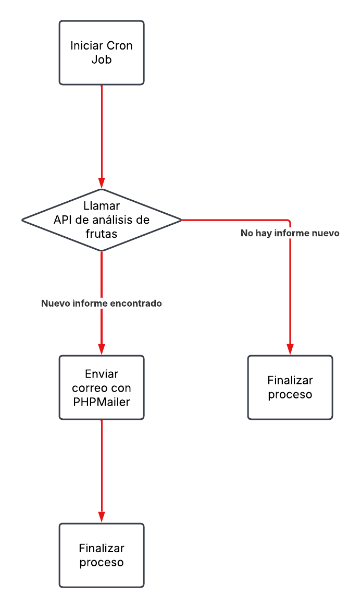

# PHP-Mail-API
Se trata de un Cron Job que se ejecuta a diario y consume la API de una empresa especializada en el análisis de frutas. Su objetivo es verificar si se ha publicado un nuevo informe de análisis de frutas y, en caso afirmativo, enviar un correo electrónico al encargado.

